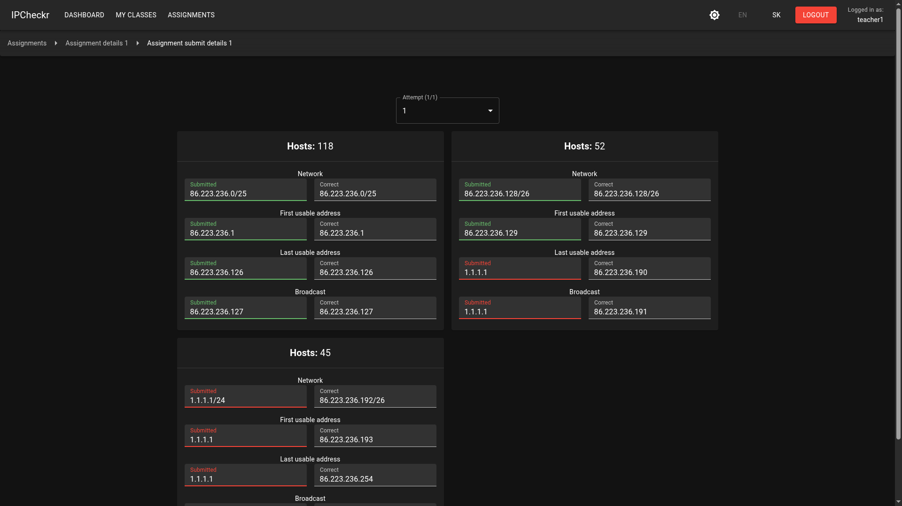
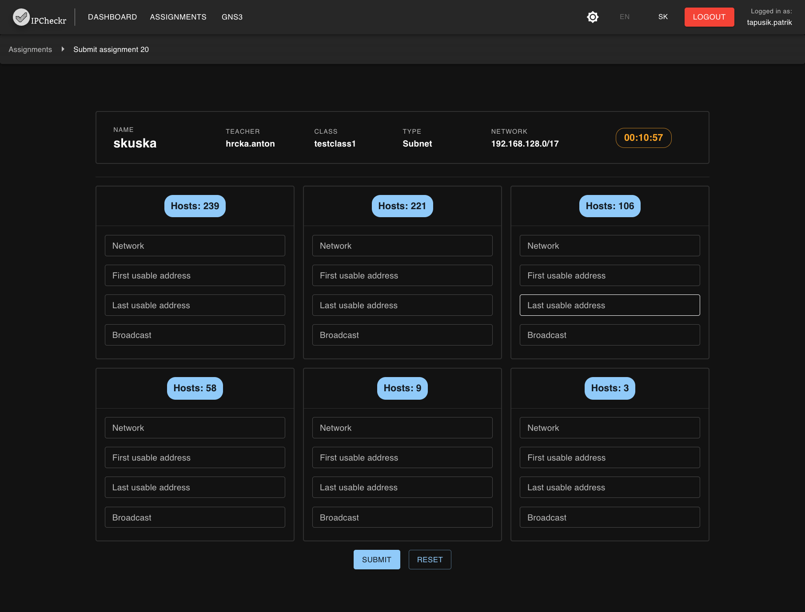
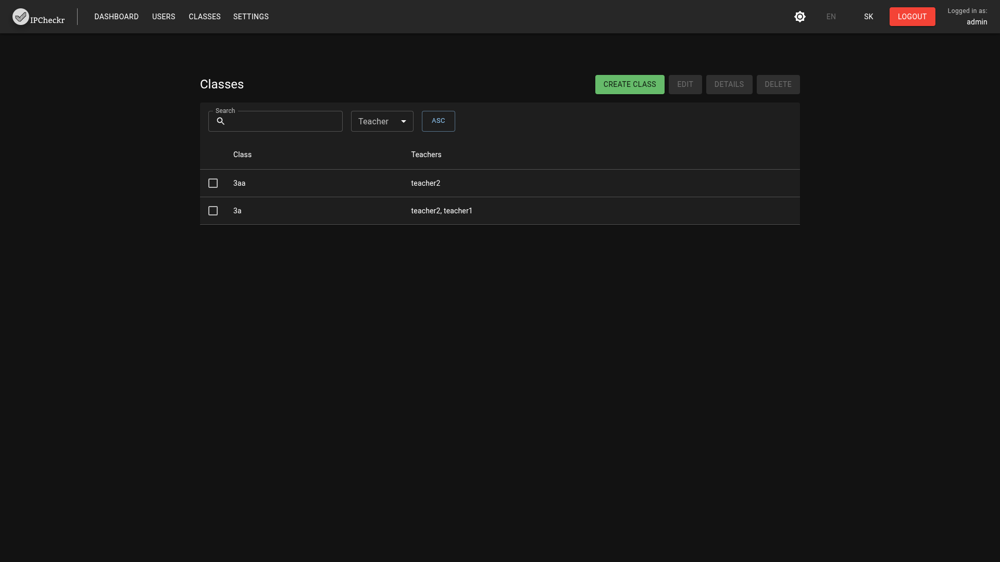
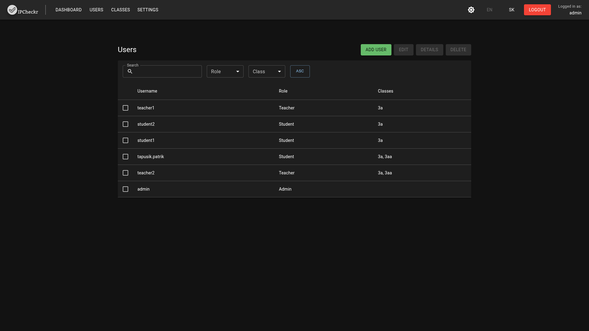

# IPCheckr

A minimal self-hosted application for teaching and testing subnetting and IP networking concepts.  
Provides role-based management for administrators, teachers and students with a web client and .NET API.

## Images

### Teacher's view

### Student's view

### Admin's view

## Quickstart (local, with Docker)
0. Have Docker installed on your system.
1. (Optional) Pull the latest image from Docker Hub:
   `docker pull tapinko/ipcheckr:latest`
2. Download the docker compose file (Docker/compose.yml)
3. Start services (API + DB):
   docker compose -f Docker/compose.yml up -d
4. Open the app at: http://localhost:8080

## Development
- Client: open [Src/IPCheckr.Client](Src/IPCheckr.Client) in your preferred code editor. Use Vite for local dev (`npm run dev` in Client directory).
- API: open [Src/IPCheckr.Api](Src/IPCheckr.Api) in your preferred code editor. The API serves static client files from wwwroot in production. For development, deploy the [ipcheckr-mariadb-dev container](Dev/ipcheckr-mariadb-dev.yml) and run `dotnet watch` inside the API directory.

### Contents
- Server: ASP.NET Core API ([`IPCheckr.Api`](Src/IPCheckr.Api)) — [Src/IPCheckr.Api](Src/IPCheckr.Api)  
- Client: React + Vite app ([`IPCheckr.Client`](Src/IPCheckr.Client/src/)) — [Src/IPCheckr.Client/src/](Src/IPCheckr.Client/src/)  
- Client i18n: language enums and keys ([`Language`, `TranslationKey`](Src/IPCheckr.Client/src/utils/i18n.ts)) — [Src/IPCheckr.Client/src/utils/i18n.ts](Src/IPCheckr.Client/src/utils/i18n.ts)  
- Client entry: [Src/IPCheckr.Client/index.html](Src/IPCheckr.Client/index.html)  
- Docker: multi-stage build and compose files — [Docker/Dockerfile](Docker/Dockerfile), [Docker/compose.yml](Docker/compose.yml)  

## TODO

Because this is in very early development, not all features are working. Here are some features planned/in-scope:

- Proper dashboards (priority)
- Refactoring the API code to make it more readable (this whole project is for me to learn .NET)
- More advanced admin settings page
- Personalized settings pages (long-term)

## License

This project is available under the MIT License — see the LICENSE file.