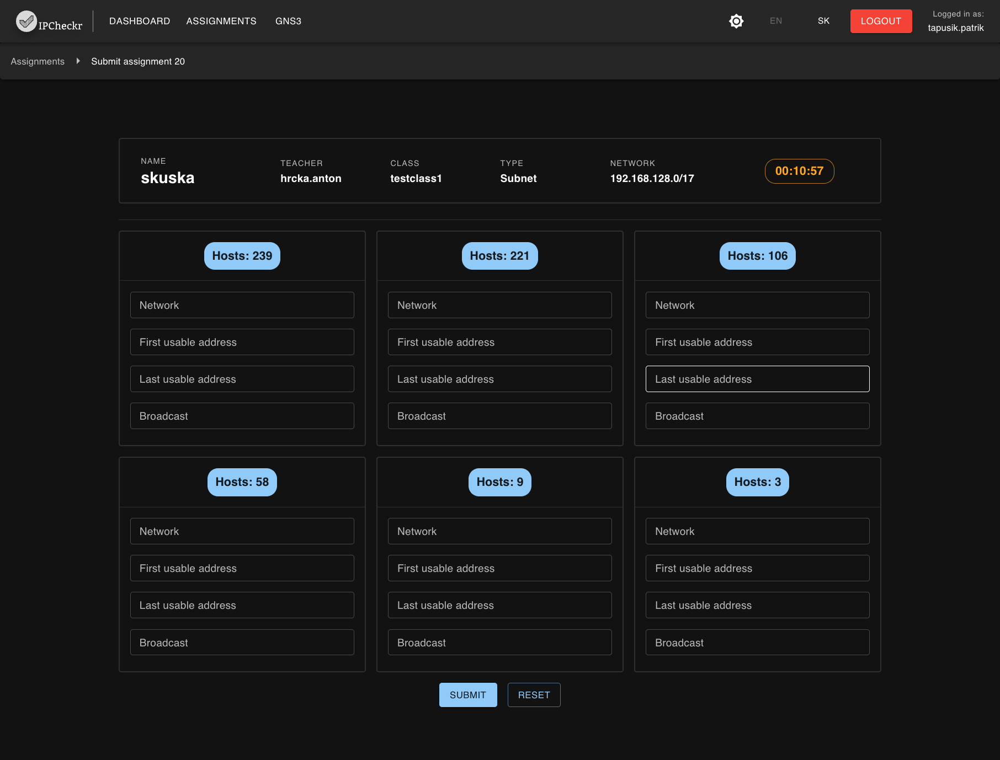
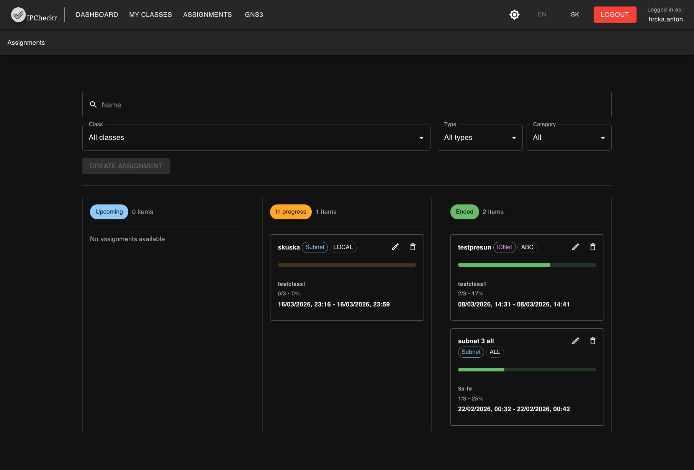
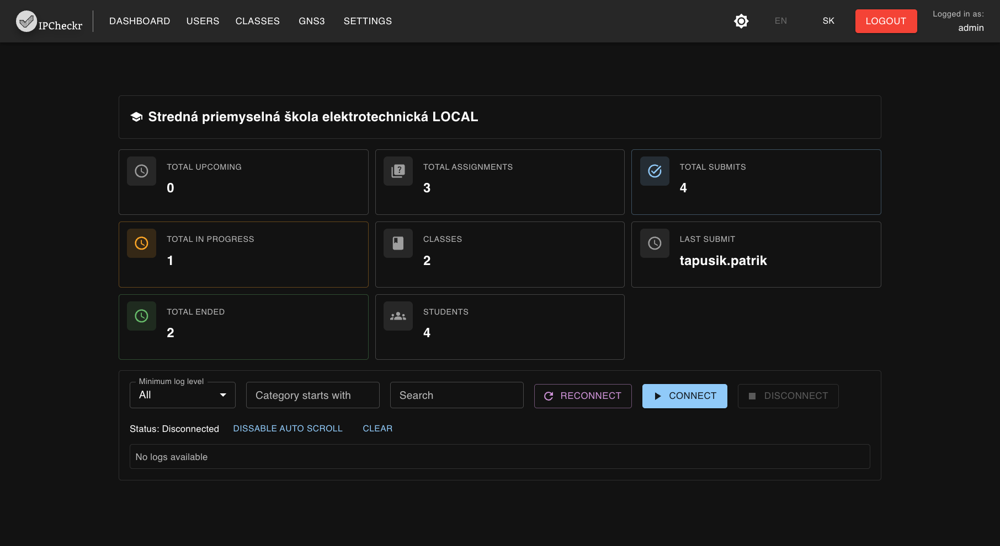

# IPCheckr


IPCheckr is an open-source learning platform for IPv4 subnetting practice in school environments. It combines automatic assignment generation, instant grading, role-based dashboards, and per-user GNS3 instances in one system.

## Project at a glance
- Built for subnetting and IDNet exercises with automatic evaluation.
- Designed for classrooms: student, teacher, and admin workflows.
- Supports local accounts and AD/LDAP authentication.
- Includes optional isolated GNS3 sessions for each user.
- Ready for self-hosted deployment with Docker and installer scripts.

## Sneakpeaks

### Student



### Teacher



### Admin



## Core capabilities
- Automatic generation of subnetting/IDNet assignments per student.
- LDAP/AD integration with role mapping.
- GNS3 session orchestration with per-user isolation.

## Quick start
Run the installer:

```bash
curl -fsSL https://raw.githubusercontent.com/tapinko/ipcheckr/master/Deploy/install.sh -o install.sh && sudo bash install.sh
```

The installer guides setup, writes configuration, and starts the stack. Default login after first run: `admin` / `admin` (change immediately).

## Tech stack
- Frontend: React + Vite + MUI
- Backend: ASP.NET Core (.NET 8)
- Database: MariaDB
- Deployment: Docker / Docker Compose

### Tested distributions
- Ubuntu 25.04

## License
MIT — see LICENSE.