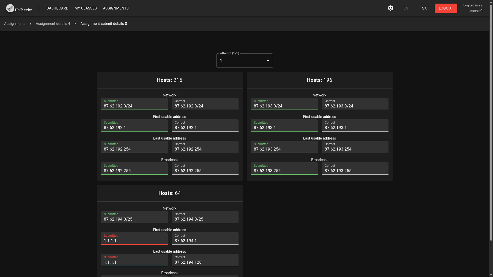

# IPCheckr

IPCheckr is a system for learning and testing subnetting. Students practice and get quick results, teachers manage classes, and sign-in can use your AD/LDAP. With GNS3 support, each user can launch their own lab safely.

## What it does
- Subnetting drills and automated grading for students.
- Multi-user classroom flows for teachers (assignments, submissions).
- Admin workflows for managing org structure and users.
- AD/LDAP authentication with role mapping.
- Multi-user GNS3 integration (per-user server sessions with AD-backed access control).

## Screenshots

### Teacher

### Student

### Admin

## Authentication
- **Local**: seeded admin `admin` / `admin` on first run (change immediately).
- **AD/LDAP**: configurable host/port/SSL, bind or DN template, search base, username attribute, and group DNs for teacher/student role mapping. Switch auth mode in Admin -> Settings.

## GNS3 integration (multi-user)
- Per-user GNS3 server sessions orchestrated by the backend; port/PID tracking stored in DB.
- AD-authenticated users get their own GNS3 instance; files remain per-user under service ownership.

## Quickstart (Docker for now)
1. Install Docker / Docker Compose.
2. (Optional) pull the image: `docker pull tapinko/ipcheckr:latest`.
3. Run: `docker compose -f Docker/compose.yml up -d`
4. Open https://localhost:8081 and log in as `admin` / `admin`.

## License
MIT — see LICENSE.